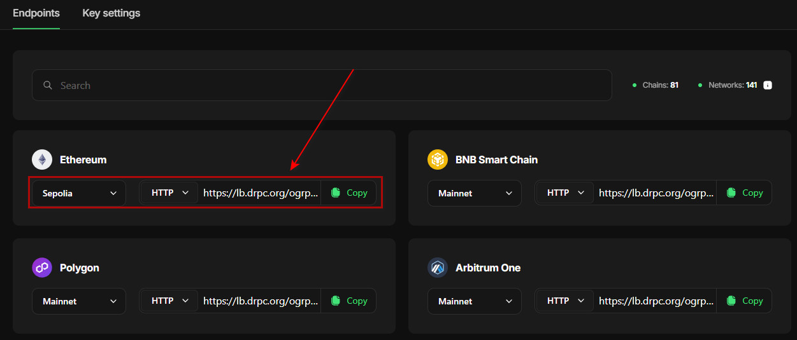
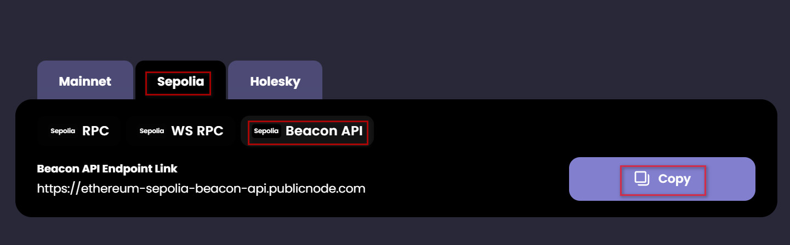

# [](https://git.io/typing-svg) Unichain Node installation Guide

<p align="center">

</p>


## Install Node Your WSL/VPS 
```
source <(wget -O - https://raw.githubusercontent.com/BidyutRoy2/unichain-node/refs/heads/main/node.sh)
```

### You Go To Direct Edit env File & Set RPC Sepolia & Beacon API
- Use Arrow Key Up/Down/Left/Right (Save: CTRL+X Then Y Then Enter)

Get L1 RPC : https://drpc.org?ref=186ce1
- Create Account & Create API Keys >
<p align="left">

</p>

Get Public beacon endpoints : https://ethereum-sepolia.publicnode.com
<p align="left">

</p>

## Run Node
```
docker compose up -d
```

## Check Docker Unichain Node Container
```
docker ps -a
```
### Copy Container ID - unichain-node-execution-client-1

Check Node Logs
```
docker logs -f Container ID
```
OR 
```
docker logs Container ID
```

## Node Directory/Folder
```
cd unichain-node
```

---------------------------------------------------------------------------------------------------------------
Future Stop Delete/Remove Unichain Node File
```
docker stop $(docker ps -aqf "name=unichain-node") && docker rm $(docker ps -aqf "name=unichain-node")
```

# ▄︻デ𝙂𝙚𝙩 𝙇𝙖𝙩𝙚𝙨𝙩 𝘼𝙞𝙧𝙙𝙧𝙤𝙥𝙨 & 𝙐𝙥𝙙𝙖𝙩𝙚𝙨═━一

### ▄︻デ𝙅𝙤𝙞𝙣 𝙏𝙚𝙡𝙚𝙜𝙧𝙖𝙢═━一 [🎀  𝐻𝒾𝒹𝒹𝑒𝓃 𝒢𝑒𝓂  🎀](https://t.me/hiddengemnews) 

### ░▒▓█►─═  𝓗𝓲𝒹ᗪ𝓔η Ǥέ𝕄 ═─◄█▓▒░
